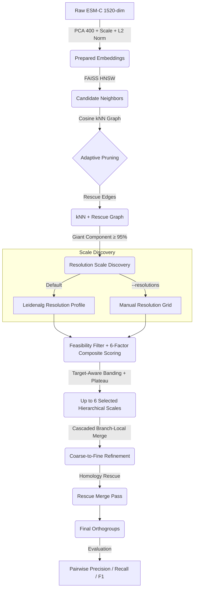

# EvoCluster — Embedding-Guided Multiscale Orthogroup Detection

> **Can protein embeddings replace alignment-based ortholog detection?**
>
> EvoCluster replaces the alignment-heavy core of orthogroup detection with protein language model (pLM) embeddings combined with a multiscale graph clustering pipeline. ESM-C embeddings are clustered using cosine kNN graphs, Leiden community detection under the CPM objective, automated resolution scale discovery, and a branch-local merge cascade to produce orthogroups — faster and more scalable than traditional BLAST + MCL pipelines like OrthoFinder.

**Authors**: Hanzala Sharique, Suraj Kashyap, Samyajit Das, and Ashish Kumar Layek <br>
**Acknowledgement**: Dr. Soumitra Pal (National Eye Institute, USA) <br>
**Affiliation**: Department of Computer Science and Technology, Indian Institute of Engineering Science and Technology, Shibpur <br>

---

## Table of Contents

- [Background](#background)
- [Project Phases](#project-phases)
- [Pipeline Architecture](#pipeline-architecture)
- [Pipeline Stages](#pipeline-stages)
- [Datasets](#datasets)
- [Results](#results)
- [Configuration & Hyperparameters](#configuration--hyperparameters)
- [Usage](#usage)
- [Repository Structure](#repository-structure)
- [References](#references)

---

## Background

### Why Orthogroups?

Orthogroups collect proteins that originate from a common ancestral gene. Because such proteins often retain related biological functions, the groups themselves are widely used for functional annotation, evolutionary analysis, and large-scale genome studies. Classical tools like OrthoFinder combine sequence similarity search, graph construction, and phylogenetic refinement — but they scale poorly and make limited use of modern representation learning.

### Key Terminology

| Term | Definition |
|------|-----------|
| **Orthologs** | Homologous genes split by **speciation** across species |
| **Paralogs** | Homologous genes split by **duplication** within a species |
| **Orthogroups** | All related genes (orthologs + paralogs) descended from one ancestral gene |
| **pLM** | Protein Language Model — a neural network trained on protein sequences |
| **Embeddings** | Numerical vector representations encoding structural and evolutionary signals |

### Motivation

Protein language models replace repeated pairwise comparison with a single forward pass per sequence. Each protein is mapped to a dense vector that the model has learned to produce from its training distribution. If this learned geometry preserves homology strongly enough, then clustering directly in embedding space may be sufficient for orthogroup recovery — with no further sequence alignment.

---

## Project Phases

### Phase 1 — Homology Feature Capture with pLMs ✅

Benchmarked four pLMs (ESM-1, ESM-2, ESM-C, ProtT5) across 114 Pfam families by correlating embedding-space pairwise distances with LG tree distances built using FastTree. Both full-length and domain-only inputs were evaluated layer by layer.

**Key findings:**
- ESM-C, despite being the lightest model, performs on par with ProtT5 and ESM-2 on deep layers
- Restricting input to conserved domains gives nearly identical correlation curves
- Deeper layers carry stronger homology information across all four models
- Inter-family correlations are uniformly higher than intra-family values

**Selected**: ESM-C, layer 34 as the embedding backbone.

### Phase 2 — Multiscale Clustering Pipeline ✅

Built and evaluated the multiscale KNN + Leiden clustering pipeline. Tested alternative clustering methods (K-means, HDBSCAN, Agglomerative, single-resolution Leiden) and found that no single flat clustering approach could handle orthogroup sizes spanning two orders of magnitude. This motivated the multiscale design.

---

## Pipeline Architecture



### Core Principles

1. **Graph quality > clustering algorithm** — Pruned cosine kNN graphs remove spurious connections naturally
2. **Multiscale structure > single resolution** — A single parameter can't handle orthogroup sizes from 2 to 200+
3. **Local refinement > global merging** — Only siblings sharing a coarse parent can merge (no global O(K²))
4. **Progressive stringency** — Merge thresholds tighten across cascade stages via quadratic escalation

---

## Pipeline Stages

### Stage 1: Embedding Preparation

```
Raw ESM-C (1520-dim) → PCA(400) → StandardScaler → L2-Normalize
```

PCA dimension selected via scree plot analysis: ~400 principal components capture most of the variance across all four datasets while keeping the kNN graph construction manageable. L2 normalisation ensures inner products approximate cosine similarity.

### Stage 2: Graph Construction

#### Adaptive Neighbourhood Size
The neighbourhood size k follows a square-root relationship with dataset size:

```
k = min(⌈0.6 × √N⌉, 150)
```

This rule transfers across datasets without manual adjustment — from 10k to 60k+ proteins.

#### Cosine kNN Graph
- **FAISS HNSW** for fast approximate kNN (with sklearn fallback)
- **Adaptive pruning**: edges below `1/k` threshold are removed
- **Rescue edges**: high-cosine-similarity pairs (≥ 0.92) get edges even if not in each other's kNN
- **Quality gate**: giant component must cover ≥ 95% of the graph

### Stage 3: Architecture Discovery + Hierarchy

#### Resolution Scale Discovery
- **Default**: `leidenalg` resolution profile — finds discrete transition points where the optimal partition under CPM changes. Preferred because it is aligned with the CPM objective, computationally cheap (single pass), and deterministic.
- **Manual grid** (`--resolutions`): runs Leiden CPM at user-specified resolution values.

#### Hierarchy Construction
Each fine cluster is linked to the coarser level by maximum membership overlap:

```
parent(Cf) = argmax |Cf ∩ Cc| / |Cf|
```

No hard threshold — guarantees a complete hierarchy with no orphan clusters.

### Stage 4: Stability + Scale Selection

A composite stability score selects a subset of levels:

```
S = 0.18·NMI + 0.18·Cohesion + 0.18·Separation + 0.12·SizeReg + 0.10·Consensus − 0.14·FragPenalty
```

Combined with a **soft Gaussian prior** over the target cluster count (roughly N/3) to let the cascade settle on the scale best supported by the data. Up to 6 levels are retained with target-aware banding and K-spacing diversity.

### Stage 5: Branch-Local Merge Cascade

**No global O(K²) merging.** Cascaded merge from coarse to fine levels, with thresholds that tighten across stages via quadratic escalation:

```
τ_cos(s) = τ_cos₀ + 0.10·t²
τ_edge(s) = τ_edge₀ + 0.05·t²
```

where `t = s/(S−1)` is the normalised stage index.

**Hybrid merge criterion**: strong edge connectivity alone can trigger a merge, or both centroid cosine similarity and edge connectivity must pass.

**Homology rescue**: a post-merge pass allows small high-confidence clusters to merge when centroids are very close (cosine ≥ 0.95), even without a graph edge.

### Stage 6: Evaluation

| Metric Type | Description |
|---|---|
| **Pairwise Precision / Recall / F1** | Protein-pair agreement (N:M and 1:1 matching) |
| **Information Theoretic** | AMI, V-measure, Homogeneity, Completeness |

---

## Datasets

Four orthogroup datasets obtained from OrthoMCL:

| Dataset | Species | # Proteins | # Orthogroups |
|---------|---------|-----------|--------------|
| Frog–Zebrafish (`drer_xtro`) | *D. rerio* × *X. tropicalis* | 61,670 | 18,374 |
| Mouse–Human (`mmus_hsap`) | *M. musculus* × *H. sapiens* | 45,087 | 16,659 |
| Apicomplexa ×7 | 7 Apicomplexan species | 42,839 | 17,822 |
| Plasmodium ×2 (`pfal_pber`) | *P. falciparum* × *P. berghei* | 10,263 | 5,315 |

Each dataset includes per-protein ESM-C embeddings (1520-dimensional), a FASTA file, and OrthoMCL ground-truth labels.

---

## Results

### Final Pipeline Performance

| Dataset | Precision | Recall | F1 |
|---------|-----------|--------|-----|
| Frog–Zebrafish | 86.70 | 39.56 | 54.33 |
| Mouse–Human | 82.26 | 27.43 | 41.14 |
| Apicomplexa ×7 | 59.77 | 68.78 | 63.96 |
| Plasmodium ×2 | 58.60 | 50.10 | 54.00 |

### Key Observations

- **Precision is consistently high** — ESM-C embeddings after PCA and L2 normalisation are discriminative enough that proteins from unrelated families rarely end up in the same cluster
- **Recall is the harder side** — large reference orthogroups still tend to be split across more than one Leiden cluster, even after rescue edges, homology-driven merges, and the cascaded strategy
- **The adaptive k rule transfers** across all datasets without manual adjustment (10k–60k proteins)
- **A single global threshold is insufficient** — relaxed values over-merge at fine scales while strict values under-merge at coarse ones, justifying the multiscale design

---

## Configuration & Hyperparameters

### Default Settings

| Component | Setting |
|---|---|
| ESM-C layer | 34 |
| PCA dimension | 400 |
| Adaptive kNN coefficient | c = 0.6 |
| kNN cap | 150 |
| Cascade levels | 6 |
| Prune method | `inverse_k` (threshold = 1/k) |
| Edge connectivity norm | `n_cross / (min(\|A\|,\|B\|) × k)` |
| Merge scoring | `0.7 × edge_conn + 0.3 × cos_sim` |
| Centroid merge threshold | 0.85 (base, + quadratic escalation) |
| Edge connectivity threshold | 0.05 (base, + quadratic escalation) |
| Giant component gate | ≥ 95% |
| Rescue edges | On (cosine ≥ 0.92) |
| Homology rescue | On (cosine ≥ 0.95, cluster size ≤ 20) |
| Discovery mode | Leidenalg Resolution Profile |
| Objective function | CPM |
| Evaluation primary score | Pairwise F1 |

### Hyperparameter Optimisation

The dominant hyperparameters interact non-linearly. We used **Bayesian optimisation through Optuna** in two complementary modes:

- **`sweep_parameters.py`** — Bilevel parallel sweep: outer loop over `k_coeff ∈ {0.3, 0.45, 0.6, 0.75}` via Joblib, inner loop tunes merge thresholds
- **`sweep_merge_fast.py`** — Fast single-graph sweep: builds graph + hierarchy once, then runs Optuna trials over merge parameters only

The optimiser converged on `c = 0.6` as the most consistent choice.

---

## Usage

### Running the Pipeline

```bash
cd src/Phase\ 2
python multi_scale_exp.py <organism>
```

where `<organism>` is one of `pfal_pber`, `mmus_hsap`, `drer_xtro`, etc.

#### Examples

```bash
# Basic run with default settings (resolution profile discovery)
python multi_scale_exp.py pfal_pber

# With custom manual resolutions (disables profile discovery)
python multi_scale_exp.py mmus_hsap --resolutions 0.05,0.1,0.2,0.5

# With custom graph density
python multi_scale_exp.py drer_xtro --k_coeff 0.3 --k_cap 120

# With GPU acceleration
python multi_scale_exp.py mmus_hsap --use_gpu

# Disable rescue features
python multi_scale_exp.py pfal_pber --no_rescue_edges --no_homology_rescue
```

### KNN vs SNN Comparison

```bash
python compare_knn_snn.py pfal_pber mmus_hsap drer_xtro
```

### All CLI Options

```
python multi_scale_exp.py <organism> [OPTIONS]

Graph Construction:
  --k_coeff           k = coeff × √N (default: 0.6)
  --k_cap             Max k (default: 150)
  --k_override        Override adaptive k with a fixed value
  --graph_type        knn | snn (default: knn)

Scale Discovery:
  --resolutions       Comma-separated CPM resolutions (disables profile discovery)
  --objective         CPM | modularity (default: CPM)

Merge Refinement:
  --centroid_cos_threshold       Base cosine merge threshold (default: 0.85)
  --edge_connectivity_threshold  Base edge connectivity threshold (default: 0.05)
  --no_homology_rescue           Disable homology-rescue merge path
  --homology_rescue_cos          Cosine threshold for homology rescue (default: 0.95)

Graph Rescue:
  --no_rescue_edges              Disable hybrid rescue edges (default: on)
  --rescue_cos_threshold         Cosine threshold for rescue edges (default: 0.92)

Selection:
  --target_cluster_ratio         Soft prior for target K as fraction of N (default: 1/3)
  --max_selected_levels          Max hierarchy levels to select (default: 6)

Other:
  --seed              Random seed (default: 0)
  --use_gpu           Use GPU acceleration (FAISS GPU)
```

### Output

Results are saved to `Model_Cluster_Results/multiscale/<organism>/` and include:
- Cluster labels (fine level)
- Full merge log and stage summaries
- Per-level scoring details
- Pairwise and information-theoretic evaluation metrics

---

## Repository Structure

```
EvoCluster/
├── README.md                              ← This file
├── EvoCluster.pdf                         # Research paper
├── requiremets.txt                        # Python dependencies
├── data/                                  # Dataset files
├── results/                               # Experiment outputs
├── src/
│   ├── Phase 1/                           # pLM homology benchmarking
│   │   ├── utils.py                       # General utilities
│   │   ├── utils_embeddings.py            # Embedding extraction utils
│   │   ├── utils_get_embeddings.py        # pLM inference helpers
│   │   ├── one_pfam.py                    # Single-family evaluation
│   │   ├── domain_one_pfam.py             # Domain-level evaluation
│   │   ├── make_corr.py                   # Full-length correlation computation
│   │   ├── domain_make_corr.py            # Domain-level correlation computation
│   │   ├── homology_corr.py               # Cross-Pfam correlation analysis
│   │   ├── build_matrix.py                # Distance matrix construction
│   │   ├── get_consensus.py               # Consensus sequence generation
│   │   ├── merge_trees.py                 # Unified LG tree construction
│   │   ├── kmeans_exp.py                  # K-means baseline experiment
│   │   └── prep_data.py / run_prep.py     # Data preparation
│   └── Phase 2/                           # ★ Multiscale clustering pipeline
│       ├── multi_scale_exp.py             # Main CLI entrypoint
│       ├── sweep_parameters.py            # Bilevel hyperparameter sweeper (Optuna + Joblib)
│       ├── sweep_merge_fast.py            # Fast merge parameter sweeper (Optuna)
│       ├── compare_knn_snn.py             # KNN vs SNN graph comparison
│       ├── run_baseline_algos.py          # Baseline clustering algorithms
│       ├── run_simple_leiden.py           # Single-resolution Leiden baseline
│       ├── cluster_lib.py                 # Clustering utilities
│       └── pipeline/                      # Modular pipeline package
│           ├── __init__.py                # Package exports
│           ├── io.py                      # Data loading, embedding prep, result saving
│           ├── graph.py                   # Cosine kNN graph construction + pruning
│           ├── discovery.py               # Resolution profile discovery (leidenalg)
│           ├── leiden.py                   # Leiden multiscale sweeps + hierarchy building
│           ├── selection.py               # 6-factor composite scoring + scale selection
│           ├── merge.py                   # Branch-local cascade merge refinement
│           └── evaluation.py              # Pairwise F1, AMI, V-measure evaluation
└── Model_Cluster_Results/                 # Per-method clustering results
    └── multiscale/{organism}/
```

---

## References

| # | Work | Relevance |
|---|------|-----------|
| 1 | **OrthoFinder** (Emms & Kelly 2019) | Reference benchmark for orthogroup detection |
| 2 | **OrthoMCL** (Li et al. 2003) | Ground-truth orthogroup labels |
| 3 | **ESM-C** (EvolutionaryScale 2024) | Lightweight pLM selected as embedding backbone |
| 4 | **Minotto et al.** (2025) | pLM-based clustering protocol for ortholog detection |
| 5 | **Leiden** (Traag et al. 2019) | Community detection algorithm used for clustering |
| 6 | **FastTree** (Price et al. 2010) | Approximate ML trees for LG distance matrices |
| 7 | **Optuna** (Akiba et al. 2019) | Bayesian hyperparameter optimisation framework |
| 8 | **plmEvo** (Tule et al. 2025) | Shows pLMs encode phylogenetic signals |

---

*Last updated: 2026-05-22*
