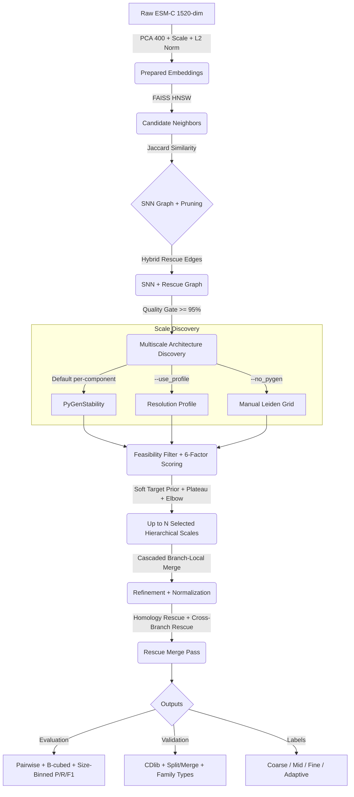

# EvoCluster — Embedding-Based Ortholog Detection

> **Can protein embeddings replace alignment-based ortholog detection?**
>
> EvoCluster uses ESM-C protein language model embeddings, PCA dimensionality reduction, and multiscale graph clustering to form orthogroups — faster and potentially more effective than traditional BLAST + MCL pipelines like OrthoFinder.

**Authors**: Hanzala Sharique, Suraj Kashyap, Samyajit Das <br>
**Supervisor**: Prof. Ashish Kumar Layek <br>
**Acknowledgements**: Dr. Soumitra Pal (National Eye Institute, USA) <br>

---

## Table of Contents

- [Background](#background)
- [Project Phases](#project-phases)
- [Pipeline Architecture](#pipeline-architecture)
- [Pipeline Stages](#pipeline-stages)
- [Datasets](#datasets)
- [Evaluation Metrics](#evaluation-metrics)
- [Configuration & Hyperparameters](#configuration--hyperparameters)
- [Usage](#usage)
- [Repository Structure](#repository-structure)
- [Key Improvements Over Flat Clustering](#key-improvements-over-flat-clustering)
- [References](#references)

---

## Background

### Why Compare Proteins?

- Diseased vs. healthy organisms differ at the protein level — finding the altered protein helps identify disease causes.
- If the same protein exists in other species, they may be prone to the same disease and treatable similarly.
- To do this, we need to know which proteins are **evolutionarily related** → these sets are called **orthogroups**.

### Key Terminology

| Term | Definition |
|------|-----------|
| **Orthologs** | Homologous genes split by **speciation** across species |
| **Paralogs** | Homologous genes split by **duplication** within a species |
| **Orthogroups** | All related genes (orthologs + paralogs) descended from one original gene |
| **pLM** | Protein Language Model — a neural network trained on protein sequences |
| **Embeddings** | Numerical vector representations capturing functional/evolutionary properties |

### OrthoFinder Limitations

OrthoFinder (the current standard) has:
- Strong dependence on sequence alignment quality
- High computational cost on large datasets
- No leverage of modern embedding-based approaches

---

## Project Phases

### Phase 0 — Preliminary Validation ✅

Validated that ESM-C embeddings hold strong evolutionary signal in high dimensions using PCA + UMAP visualization on a small OrthoFinder example dataset.

### Phase 1 — Model Benchmarking ✅

Evaluated ProtT5, ESM2, ESM-C, and ESM1 across 114 Pfam families using Evolutionary Similarity Scores (ESS). **Selected ESM-C layer 34** as the optimal model + layer combination based on Spearman/Pearson correlations against LG evolutionary distances.

### Phase 2 — Clustering for Orthogroup Formation 🔧 (Active)

Implementing and evaluating the **multiscale SNN + Leiden clustering pipeline** to form orthogroups from embeddings.

---

## Pipeline Architecture



### Core Principles

1. **Graph quality > clustering algorithm** — Jaccard SNN graphs prune rare, spurious connections naturally
2. **Multiscale structure > single resolution** — A single parameter can't handle varying orthogroup sizes
3. **Local refinement > global merging** — Only siblings sharing a coarse parent can merge
4. **Stability across scales > one-shot optimization** — Graph-aware metrics prevent misleading selections

---

## Pipeline Stages

### Stage 1: Embedding Preparation

```
Raw ESM-C (1520-dim) → PCA(400) → StandardScaler → L2-Normalize
```

- **Function**: `prepare_embeddings()`
- Extracts layer-34 embeddings, reduces to 400 dims, scales, and L2-normalizes for cosine kNN

### Stage 2: SNN Graph Construction

#### 2a. Adaptive k Computation
- **Formula**: `k = min(ceil(0.6 × √N), 150)`
- Examples: N=40k → k=120, N=50k → k=134, N=60k → k=147

#### 2b. Candidate Neighbor Search
- **FAISS HNSW** for fast approximate kNN (with sklearn fallback)
- Returns neighbor indices, scores, and precomputed neighbor sets

#### 2c. Jaccard SNN Graph + Adaptive Pruning
- **SNN Weight**: Jaccard Similarity = `|kNN(i) ∩ kNN(j)| / |kNN(i) ∪ kNN(j)|`
- **Pruning**: `inverse_k` (threshold = 1/k) or `percentile` (drop bottom N%)
- **Quality Gate**: Giant component must be ≥ 95% of all nodes

### Stage 3: Architecture Discovery + Hierarchy

#### 3a. Multiscale Resolution Sweep
- **PyGenStability (Default)**: Runs a bounded Markov-stability sweep first and keeps only feasible distinct candidate partitions.
- **Resolution Profile** (`--use_profile`): Extracts Leiden plateau stability states with bounded resolution range and post-thinning by K-spacing.
- **Manual Grid** (`--no_pygen`): Runs predefined Leiden CPM resolutions `[0.01, 0.02, 0.04, 0.06, 0.08, 0.10, 0.15, 0.20, 0.30, 0.45, 0.60, 0.80, 1.00]`.
- Returns label matrix (N × n_resolutions)

#### 3b. Hierarchy Construction
- **Argmax overlap**: Each fine cluster → parent with maximum membership overlap
- No hard threshold — guarantees complete tree with no orphans
- Weak parent-child links are warned but never dropped

### Stage 4: Stability + Scale Selection

**Metrics computed per level** (6-factor composite):
1. NMI between adjacent resolution levels
2. **Cohesion**: Weighted intra-cluster edge density
3. **Separation**: 1 − mean conductance
4. **Size Regularizer**: Penalizes extreme fragmentation
5. **Fragmentation Penalty**: Penalizes high singleton ratios
6. **Consensus Stability**: Mean pairwise NMI across multiple Leiden seeds

**Selection mechanism**: Retains a coarse-to-fine subset with target-aware anchoring near a biologically plausible K region (roughly `N/3` when enough feasible levels exist), band-aware diversity, and K-monotonic ordering. The active implemented policy is `best_composite`.

### Stage 5: Branch-Local Refinement

**No global O(K²) merging.** Only siblings under the same coarse parent are candidates.

**Hybrid merge criterion**:
1. Strong graph evidence alone can trigger a merge
2. Otherwise both centroid cosine similarity and SNN edge connectivity must pass

**Graph-aware normalization**:
`edge_conn = n_cross / (min(|A|, |B|) × k)`

**Multi-level output**: Returns coarse, mid, fine, and adaptive labels.

### Stage 6: Evaluation

| Metric Type | Description |
|---|---|
| **Pairwise Precision / Recall / F1** | Protein-pair agreement between predicted clusters and true orthogroups |
| **AMI** | Adjusted Mutual Information vs true orthogroup assignments |
| **Topological** | (CDlib) Modularity, Conductance, Density, Internal Density, Node Coverage (diagnostic only) |

---

## Datasets

| Dataset | Species | Description |
|---------|---------|-------------|
| `pfal_pber` | *P. falciparum* × *P. berghei* | Small benchmark |
| `mmus_hsap` | *M. musculus* × *H. sapiens* | ~40k proteins |
| `drer_xtro` | *D. rerio* × *X. tropicalis* | ~60k proteins |

Each organism folder contains:
- `index_to_label.csv` — maps integer index to protein header
- `{index}.pt` — per-protein ESM-C embeddings

---

## Configuration & Hyperparameters

### Default Settings

| Component | Setting |
|---|---|
| ESM-C layer | 34 |
| PCA dimension | 400 |
| k coefficient | 0.6 |
| k cap | 150 |
| SNN metric | Jaccard Similarity |
| SNN prune method | `inverse_k` (threshold = 1/k) |
| Edge connectivity norm | `n_cross / (min(|A|,|B|) × k)` |
| Merge criterion | Hybrid OR (strong edge alone OR centroid+edge) |
| Merge scoring | `0.7 × edge_conn + 0.3 × cos_sim` |
| Stability composite | 6-factor composite `(NMI, Cohesion, Separation, Size, Consensus, -Frag)` |
| Discovery mode | PyGenStability (default; bounded, with fallback to manual grid when too few feasible levels are found) |
| Objective function | CPM |
| Centroid merge threshold | 0.85 (cosine, with quadratic escalation per stage) |
| Edge connectivity threshold | 0.05 (base, with quadratic escalation per stage) |
| Giant component gate | ≥ 95% |
| Output level | `fine` |
| Evaluation primary score | Pairwise F1 |
| PHATE scale discovery | Off (opt-in via `--use_phate`) |

### Tuning Priority (in order of impact)

1. `--k_coeff` — Neighborhood coefficient (0.3–0.8). Higher = denser SNN graph, more merge opportunities
2. `--resolutions` — Manual resolution grid. Lower values usually mean larger clusters
3. `--use_phate` — Automatic scale discovery (replaces manual --resolutions)
4. `--centroid_cos_threshold` — Merge criterion Path B (0.75–0.95). Lower = more merging
5. `--edge_connectivity_threshold` — Edge min(A,B) threshold (0.01–0.20). Lower = easier merge
6. `--selection_policy` — currently only `best_composite` is meaningfully implemented; other CLI values alias the same scorer with a warning

---

## Usage

### Basic Run

```bash
cd Cluster_exps/src
python multi_scale_exp.py pfal_pber
```

### With Custom Resolutions

```bash
python multi_scale_exp.py mmus_hsap --resolutions 0.05,0.1,0.2,0.5
```

### With Custom Graph Parameters

```bash
python multi_scale_exp.py drer_xtro --k_coeff 0.3 --k_cap 120
```

### With PHATE Automatic Scale Discovery

```bash
python multi_scale_exp.py mmus_hsap --use_phate
python multi_scale_exp.py drer_xtro --use_phate --centroid_cos_threshold 0.80
```

PHATE uses diffusion condensation to automatically discover natural data scales, then maps them to Leiden CPM resolutions via binary search. No manual `--resolutions` grid needed. Requires: `pip install git+https://github.com/KrishnaswamyLab/Multiscale_PHATE`

### All CLI Options

```
python multi_scale_exp.py <organism> [OPTIONS]

Preprocessing:
  --layer             ESM-C layer (default: 34)
  --pca_dim           PCA components (default: 400)

Graph:
  --k_coeff           k = coeff * sqrt(N) (default: 0.6)
  --k_cap             Max k (default: 150)
  --k_override        Override adaptive k with fixed value
  --prune_method      SNN pruning: inverse_k | percentile

Leiden:
  --resolutions       Comma-separated CPM resolutions
  --objective         CPM | modularity
  --min_cluster_size  Recorded for traceability; currently not enforced in Leiden outputs

Refinement:
  --centroid_cos_threshold       Cosine merge threshold (default: 0.85)
  --edge_connectivity_threshold  Edge connectivity threshold (default: 0.05)
  --output_level                 coarse | fine | adaptive

Evaluation:
  --alpha             Deprecated; retained for CLI compatibility, no effect on pairwise evaluation

Scale Discovery:
  --use_phate         Enable PHATE automatic scale discovery

Other:
  --seed              Random seed (default: 0)
  --selection_policy  best_composite | max_stability | best_density | elbow
```

---

## Repository Structure

```
MajorProject/
├── README.md                              ← This file
├── OrthoMCL/                              # OrthoFinder reference outputs + embeddings
├── data/                                  # Dataset files
├── results/                               # Experiment outputs
├── src/                                   # Phase 1 scripts
│   ├── utils.py                           # General utilities
│   ├── utils_embeddings.py                # Embedding extraction utils
│   ├── utils_get_embeddings.py            # pLM inference helpers
│   ├── one_pfam.py / domain_one_pfam.py   # Single-family evaluation
│   ├── make_corr.py / domain_make_corr.py # Correlation computation
│   ├── homology_corr.py                   # Homology correlation analysis
│   ├── build_matrix.py                    # Distance matrix construction
│   ├── get_consensus.py                   # Consensus sequence generation
│   ├── merge_trees.py                     # Unified tree construction
│   └── prep_data.py / run_prep.py         # Data preparation
├── Cluster_exps/
│   └── src/
│       ├── multi_scale_exp.py             # Active CLI entrypoint
│       ├── debug_pipeline_validation.py   # Synthetic/component validation suite
│       └── pipeline/                      # ★ Active modular pipeline package
├── extras/                                # Docs + reference materials + legacy helpers
│   ├── context.md                         # Full project context document
│   ├── pipeline.md                        # Current pipeline design doc
│   ├── multi_scale_exp_usage.md           # Practical usage guide
│   ├── next_step.md                       # Current roadmap and status
│   ├── pipeline_old.md                    # Earlier pipeline design
│   └── run_all.py                         # Batch runner
├── Model_Cluster_Results/                 # Per-method clustering results
│   └── {method}/{organism}/
└── Cluster_Results/                       # Legacy results
```

---

## Key Improvements Over Flat Clustering

| Problem | Old Approach | Multiscale Pipeline |
|---|---|---|
| Large clusters split | Increase k | Multiscale hierarchy |
| Small clusters merged | Lower k | SNN + branch-local refinement |
| Poor merging | Centroid-only | Hybrid: centroid + SNN edges |
| Fixed prune threshold | 1/15 for all datasets | Adaptive: 1/k or percentile |
| Broken hierarchy | Hard overlap threshold | Argmax overlap (no threshold) |
| Misleading stability | NMI only | NMI + intra-cluster edge density |
| Sparse graph | No quality check | Giant component ≥ 95% gate |
| Single output | One flat clustering | Coarse / Mid / Fine / Adaptive |
| Manual resolution grid | Trial-and-error | PHATE auto-discovery (opt-in) |

---

## References

| Work | Relevance |
|------|-----------|
| **OrthoFinder** (Emms & Kelly 2019) | Reference benchmark for orthogroup detection |
| **ESM-C** (EvolutionaryScale) | Lightweight pLM selected for this project |
| **Multiscale PHATE** (Burkhardt et al. 2022) | Diffusion condensation for automatic scale discovery ([Nature Biotech](https://www.nature.com/articles/s41587-021-01186-x)) |
| **plmEvo** (2025) | Shows pLMs encode homology/functional signals |
| **ESM2 + k-Means** (2025) | Similar direction; we extend with advanced clustering |

---

*Last updated: 2026-03-28*
